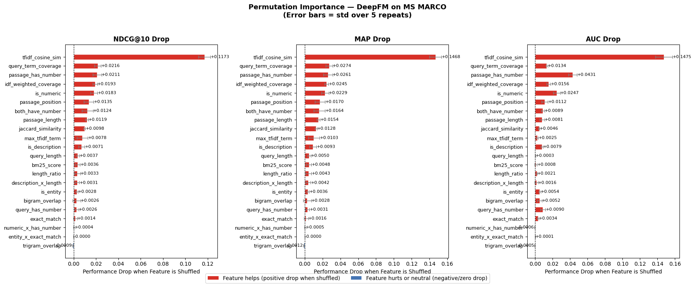
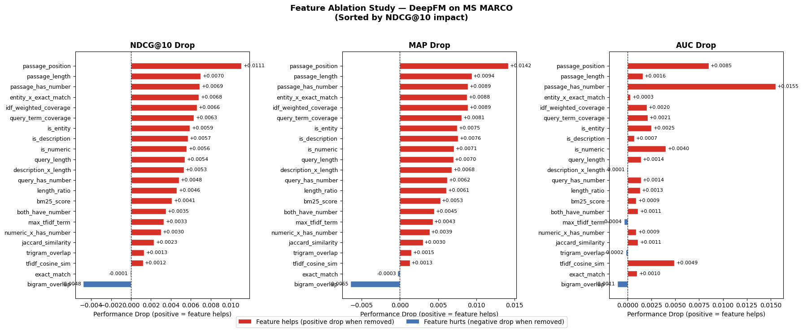

# DeepFM for Search Relevance Ranking on MS MARCO

> Applying Deep Factorization Machines to passage ranking using the MS MARCO dataset  
> University of Chicago — MSc in Applied Data Science
> Contributors: Amulya Rayasam, Grace Rowan, Khadija Shuaib

---

## Table of Contents
1. [Problem Introduction & Dataset](#1-problem-introduction--dataset)
2. [Model: DeepFM](#2-model-deepfm)
3. [Feature Engineering](#3-feature-engineering)
4. [Model Architecture & Training](#4-model-architecture--training)
5. [Feature Importance Analysis](#5-feature-importance-analysis)
6. [Model Results](#6-model-results)
7. [Reproducibility](#7-reproducibility)
8. [Repository Structure](#8-repository-structure)
9. [Setup & Installation](#9-setup--installation)

---

## 1. Problem Introduction & Dataset

### Task
Given a search query and a set of candidate passages, rank the passages by relevance so that the most relevant passage appears at the top. This is the **passage re-ranking** problem — a core component of modern search engines.

### Dataset: MS MARCO v2.1
[MS MARCO](https://microsoft.github.io/msmarco/) (Microsoft Machine Reading Comprehension) is a large-scale information retrieval benchmark built from real Bing search queries.

```python
from datasets import load_dataset
dataset = load_dataset("ms_marco", "v2.1", split="validation")
```

| Property | Value |
|----------|-------|
| Split used | Validation |
| Raw queries | 101,093 |
| Sample used | 10,000 queries |
| After explosion | ~99,840 query-passage pairs |
| Positive rate | ~10.7% (one relevant passage per query) |
| Query types | NUMERIC, DESCRIPTION, ENTITY, LOCATION, PERSON |

### Label Structure
MS MARCO uses **pointwise binary labeling** — each query has typically one relevant passage (`is_selected=1`) and several irrelevant ones (`is_selected=0`). DeepFM learns to score the relevant passage higher than irrelevant ones, enabling ranking at inference time.

### Data Pipeline
```
Raw dataset (10k rows, nested passages)
        ↓
Explode passages → each row = one query-passage pair (~99,840 rows)
        ↓
Sample 10,000 queries → explode → 99,840 query-passage pairs
        ↓
Filter queries with no relevant passage
        ↓
Feature engineering
        ↓
Train/Val/Test split by query_id (70/15/15)
```

> **Important**: We split by `query_id` (not by row) to ensure all passages for a given query stay in the same split. Splitting by row would break query groups and produce artificially inflated ranking metrics.

---

## 2. Model: DeepFM

### Overview
DeepFM (Deep Factorization Machine) is a neural architecture that jointly trains:
- A **Factorization Machine (FM)** component — learns low-order feature interactions
- A **Deep Neural Network (DNN)** component — learns high-order non-linear interactions

over shared input embeddings. Introduced by [Guo et al. (2017)](https://arxiv.org/abs/1703.04247), DeepFM learns both low-order and high-order feature interactions end-to-end without manual feature crossing.

### Why DeepFM for Search Ranking?
| Property | Benefit |
|----------|---------|
| FM component | Automatically learns pairwise feature interactions (e.g. high BM25 + short passage) |
| Deep component | Captures complex patterns beyond pairwise (e.g. query type × passage features) |
| Shared embeddings | FM and DNN learn from the same representation — no information loss |
| Binary task | Directly optimizable for binary relevance labels |

### Package
We use the [`deepctr-torch`](https://github.com/shenweichen/DeepCTR-Torch) library:

```bash
pip install deepctr-torch
```

```python
from deepctr_torch.models import DeepFM
from deepctr_torch.inputs import SparseFeat, DenseFeat, get_feature_names
```

### Mathematical Formulation

**Input Representation**

$$\mathbf{x} \in \mathbb{R}^d$$

where $d$ = total number of features. Features are either dense (continuous) or sparse (categorical). Each sparse feature field $i$ has an embedding vector $\mathbf{v}_i \in \mathbb{R}^k$ where $k$ is the embedding dimension.

**FM Component — First-Order Term**

$$y_{\text{order1}} = w_0 + \sum_{i=1}^{d} w_i x_i$$

**FM Component — Second-Order Interaction Term**

$$y_{\text{order2}} = \frac{1}{2} \sum_{l=1}^{k} \left[ \left(\sum_{i=1}^{d} v_{il} x_i \right)^2 - \sum_{i=1}^{d} v_{il}^2 x_i^2 \right]$$

This reduces computation from $O(d^2)$ to $O(kd)$.

**DNN Component**

$$\mathbf{a}^{(l+1)} = \sigma \left( \mathbf{W}^{(l)} \mathbf{a}^{(l)} + \mathbf{b}^{(l)} \right)$$

**Final Prediction**

$$\hat{y} = \sigma \left( y_{\text{FM}} + y_{\text{DNN}} \right)$$

where $\sigma$ is sigmoid for binary relevance prediction.

---

## 3. Feature Engineering

We engineer 22 features across 4 categories. All features are **dense** (continuous/binary) except `query_type_encoded` which is sparse (categorical embedding).

### Category 1: Lexical Matching
| Feature | Description |
|---------|-------------|
| `bm25_score` | BM25 relevance score between query and passage |
| `tfidf_cosine_sim` | TF-IDF cosine similarity (n-grams 1-2, 50k vocab) |
| `query_term_coverage` | Fraction of query words found in passage |
| `exact_match` | Binary — does the full query appear verbatim in passage |
| `idf_weighted_coverage` | Query term coverage weighted by IDF (rare words count more) |
| `bigram_overlap` | Fraction of query bigrams found in passage |
| `trigram_overlap` | Fraction of query trigrams found in passage |
| `jaccard_similarity` | Jaccard similarity between query and passage word sets |
| `max_tfidf_term` | Maximum TF-IDF score of any query term in the passage |

### Category 2: Statistical / Length Features
| Feature | Description |
|---------|-------------|
| `query_length` | Number of words in query |
| `passage_length` | Number of words in passage |
| `length_ratio` | query_length / (passage_length + 1) |
| `passage_position` | Index of passage in the original candidate list |

### Category 3: Numeric Content Features
| Feature | Description |
|---------|-------------|
| `passage_has_number` | Binary — passage contains digits |
| `query_has_number` | Binary — query contains digits |
| `both_have_number` | Binary — both query and passage contain digits |

### Category 4: Query Type Interaction Features
| Feature | Description |
|---------|-------------|
| `is_numeric` | Binary — query type is NUMERIC |
| `is_description` | Binary — query type is DESCRIPTION |
| `is_entity` | Binary — query type is ENTITY |
| `numeric_x_has_number` | is_numeric × both_have_number |
| `description_x_length` | is_description × passage_length |
| `entity_x_exact_match` | is_entity × exact_match |
| `query_type_encoded` | Label-encoded query type (SparseFeat — gets its own embedding) |

### BM25 Computation Note
BM25 scores are computed during feature engineering (not pre-extracted). To avoid recomputing for each row, we score each **unique query** once against all passages, then map scores back:

```python
# Efficient: score each unique query once (~6,980 calls vs ~99,840)
unique_queries = df_exploded[['query_id', 'query']].drop_duplicates()
bm25_score_map = {}
for _, row in tqdm(unique_queries.iterrows(), total=len(unique_queries)):
    query_tokens = str(row['query']).lower().split()
    bm25_score_map[row['query_id']] = bm25.get_scores(query_tokens)
```

### Sharing Pre-computed Features
Feature engineering outputs are saved as pickle files and shared via Google Drive. Teammates can skip recomputation by loading directly:

```python
df = pd.read_pickle('/content/drive/MyDrive/YOUR_FOLDER/df_features_enriched.pkl')
```

---

## 4. Model Architecture & Training

### Final Model Configuration
```python
model = DeepFM(
    linear_feature_columns=fixlen_feature_columns,
    dnn_feature_columns=fixlen_feature_columns,
    dnn_hidden_units=(128, 64, 32),
    dnn_dropout=0.3,
    task='binary',
    device=device
)

model.compile(
    optimizer='adam',
    loss='binary_crossentropy',
    metrics=['binary_crossentropy', 'auc']
)
```

### Train / Val / Test Split
```python
# Split by query_id — keeps all passages for a query in the same split
unique_qids = df['query_id'].unique()
train_qids, temp_qids = train_test_split(unique_qids, test_size=0.30, random_state=42)
val_qids, test_qids   = train_test_split(temp_qids,   test_size=0.50, random_state=42)
```

| Split | Queries | Rows |
|-------|---------|------|
| Train | ~6,986 | ~69,853 |
| Val | ~1,497 | ~14,966 |
| Test | ~1,497 | ~14,966 |

### Reproducibility
```python
def set_seed(seed=42):
    random.seed(seed)
    np.random.seed(seed)
    os.environ['PYTHONHASHSEED'] = str(seed)
    torch.manual_seed(seed)
    torch.cuda.manual_seed_all(seed)
    torch.backends.cudnn.deterministic = True
    torch.backends.cudnn.benchmark = False

set_seed(42)
```

### Sensitivity Analysis
We ran hyperparameter sensitivity analysis varying architecture size and dropout, using early stopping (`patience=3`) to ensure fair comparison:

| Architecture | Dropout | NDCG@10 | MAP |
|-------------|---------|---------|-----|
| (128, 64, 32) | 0.3 | 0.6139 | 0.4899 |
| (128, 64, 32) | 0.5 | 0.6159 | 0.4926 |
| (256, 128, 64) | 0.3 | 0.6142 | 0.4901 |
| (128, 64, 32) | 0.0 | 0.6129 | 0.4884 |
| (128, 64, 32) | 0.1 | 0.6113 | 0.4863 |

**Key findings:**
- All four (128, 64, 32) configurations produced NDCG@10 within 0.005 of each other — model is robust to dropout in the 0.0–0.5 range
- Dropout=0.0 showed the weakest performance, suggesting some regularization is beneficial
- The larger (256, 128, 64) architecture was competitive but did not meaningfully outperform the simpler (128, 64, 32) architecture — unnecessary complexity for 22 tabular features
- We selected **(128, 64, 32) with dropout=0.3** as the final architecture based on performance, simplicity, and standard regularization practice

---

## 5. Feature Importance Analysis

### Permutation Importance
We measured feature importance by shuffling each feature on the trained model and measuring the resulting performance drop (averaged over 5 repeats):

| Feature | NDCG@10 Drop ± Std | Interpretation |
|---------|-------------------|----------------|
| `tfidf_cosine_sim` | +0.1173 ± 0.0054 | Dominant feature by far — the trained model relies on semantic vocabulary overlap above all else |
| `query_term_coverage` | +0.0216 ± 0.0030 | Strong lexical matching signal |
| `passage_has_number` | +0.0211 ± 0.0040 | Numeric content is highly discriminative for factual queries |
| `idf_weighted_coverage` | +0.0193 ± 0.0020 | IDF-weighted matching outperforms raw coverage |
| `is_numeric` | +0.0183 ± 0.0032 | Query type signal — model actively uses query intent |
| `passage_position` | +0.0135 ± 0.0044 | Structural position carries meaningful relevance signal |
| `both_have_number` | +0.0124 ± 0.0050 | Numeric content interaction consistently relied upon |
| `passage_length` | +0.0119 ± 0.0013 | Passage quality indicator |
| `jaccard_similarity` | +0.0098 ± 0.0009 | Consistent word overlap signal |
| `max_tfidf_term` | +0.0078 ± 0.0050 | Meaningful but variable contribution |
| `is_description` | +0.0071 ± 0.0029 | Query type signal for description queries |
| `bm25_score` | +0.0036 ± 0.0022 | Genuine positive contributor — modest but present |
| `trigram_overlap` | -0.0009 ± 0.0005 | Only noise feature — too sparse beyond TF-IDF signal |



### Feature Ablation
We retrained the model with one feature dropped at a time (10 epochs, same seed) to measure each feature's contribution during learning:

| Tier | Features | NDCG@10 Drop | Interpretation |
|------|---------|-------------|----------------|
| High | `passage_position` | +0.0111 | Structural position is the single strongest learning signal |
| High | `passage_length` | +0.0070 | Longer passages tend to be more answer-rich and complete |
| High | `passage_has_number`, `entity_x_exact_match`, `idf_weighted_coverage`, `query_term_coverage`, `is_entity` | +0.006–0.007 | Numeric content and query-passage interaction features are surprisingly informative |
| Medium | `is_description`, `is_numeric`, `query_length`, `description_x_length`, `query_has_number`, `length_ratio` | +0.004–0.006 | Query type and structural features provide moderate collective contribution |
| Low | `bm25_score`, `both_have_number`, `max_tfidf_term`, `numeric_x_has_number`, `jaccard_similarity`, `trigram_overlap`, `tfidf_cosine_sim`, `exact_match` | +0.001–0.004 | Weak but genuine positive contributors |
| Noise | `bigram_overlap` | -0.0048 | Only feature that meaningfully hurts performance |

**Key takeaways from both analyses:**
- **`tfidf_cosine_sim` is the dominant feature in permutation importance** (+0.1173) — its drop is more than 5x larger than the next feature, revealing the trained model's heavy reliance on semantic vocabulary overlap
- **`passage_position` leads in ablation** (+0.0111) but ranks 6th in permutation — the model learns from positional ordering but ultimately relies more on semantic similarity at inference time
- **21 out of 22 features contribute positively in ablation** — the feature engineering process was well-targeted with very little wasted effort
- **Query type features punch above their weight** — `is_numeric`, `is_description`, `is_entity` and their interactions all contribute positively in both analyses
- **`bigram_overlap` is the only consistent noise feature** — redundant given TF-IDF already captures n-gram overlap via `ngram_range=(1,2)`
- **`bm25_score` shows feature redundancy vs reliance** — ranked low in ablation (other features compensate during retraining) but shows genuine positive reliance after training (+0.0036), a known phenomenon in feature importance analysis



### Parsimonious Model
Guided by permutation importance, we trained a reduced model using only the 7 most informative features:

```python
PARSIMONIOUS_FEATURES = [
    'tfidf_cosine_sim',       # dominant feature by far (+0.1173 permutation)
    'query_term_coverage',    # strong lexical signal (+0.0216)
    'passage_has_number',     # numeric content is discriminative (+0.0211)
    'idf_weighted_coverage',  # weighted matching signal (+0.0193)
    'is_numeric',             # query type signal (+0.0183)
    'passage_position',       # structural position signal (+0.0135)
    'both_have_number',       # numeric content interaction (+0.0124)
]
```

| Metric | Enriched (22 features) | Parsimonious (7 features) | Δ |
|--------|----------------------|--------------------------|---|
| NDCG@10 | **0.6139** | 0.6026 | ↓0.0113 |
| MAP | **0.4899** | 0.4751 | ↓0.0148 |
| MRR | **0.4951** | 0.4802 | ↓0.0149 |

The parsimonious model achieved competitive performance but consistently underperformed across all metrics, suggesting the 15 additional features — while individually weak — provide small collective gains. The enriched model was retained as the final model.

---

## 6. Model Results

### Experiment Comparison

| | Baseline (9 features) | Enriched (22 features) |
|--|----------------------|----------------------|
| **Architecture** | (128, 64, 32) | (128, 64, 32) |
| **Optimizer** | Adam | Adam |
| **Dropout** | 0.3 | 0.3 |
| **Train Loss** | 0.3184 | **0.3138** |
| **Val Loss** | 0.3217 | **0.3187** |
| **Train AUC** | 0.6858 | **0.7068** |
| **Val AUC** | **0.6975** | 0.6894 |
| **NDCG@5** | 0.5230 | **0.5422** |
| **NDCG@10** | 0.6021 | **0.6139** |
| **MAP** | 0.4744 | **0.4899** |
| **MRR** | 0.4809 | **0.4951** |
| **Precision@5** | 0.1610 | **0.1657** |
| **Precision@10** | 0.1060 | 0.1060 |

### Final Model — Test Set Evaluation

| Metric | Score |
|--------|-------|
| **NDCG@5** | 0.5422 |
| **NDCG@10** | 0.6136 |
| **MAP** | 0.4897 |
| **MRR** | 0.4945 |
| **Precision@5** | 0.1657 |
| **Precision@10** | 0.1062 |
| **Test Loss** | 0.3145 |
| **Test AUC** | 0.6977 |

### Interpretation

- **NDCG@10 of 0.61** is solid for a tabular-only model with no neural text embeddings. Production neural retrieval systems (BM25 + BERT reranker) achieve ~0.70+ on MS MARCO, establishing a clear ceiling for future work.

- **MRR of 0.49** means on average the first relevant passage appears around rank 2 — the model is consistently placing relevant content near the top.

- **Train AUC improved from 0.686 → 0.707** with enriched features, indicating the model had more signal to learn from and continued improving throughout all 20 epochs rather than plateauing early.

### Performance Trajectory
```
Baseline DeepFM  (9 features)    →  NDCG@10: 0.6021, MAP: 0.4744
Enriched DeepFM  (22 features)   →  NDCG@10: 0.6136, MAP: 0.4897  (Final model)
Parsimonious     (7 features)    →  NDCG@10: 0.6026, MAP: 0.4751
Future work: SBERT embeddings    →  Expected NDCG@10: 0.65+
```

### Limitations & Future Work
- **Feature ceiling**: all model variants plateau around NDCG@10 ~0.61, suggesting the bottleneck is feature quality rather than architecture or optimization
- **Dense semantic embeddings**: adding sentence-BERT (e.g. `all-MiniLM-L6-v2`) cosine similarity as a feature would provide richer semantic signal beyond TF-IDF
- **Listwise training**: the current setup uses pointwise binary labels; pairwise or listwise loss functions (e.g. LambdaRank) could better optimize ranking directly
- **Larger dataset**: using the full MS MARCO training split (~500k queries) rather than a 10k validation sample

---

## 7. Reproducibility

All results are fully reproducible. Run cells in order from top to bottom using **Kernel → Restart & Run All**.

Key reproducibility measures:
- `set_seed(42)` applied before every model instantiation
- All splits use `random_state=42`
- Splits are by `query_id` to prevent query group leakage
- `torch.save(model, ...)` saves the full model object (not just state dict) for reliable reloading

```python
# Reload saved model
model = torch.load('../models/deepfm_final.pt', map_location=device, weights_only=False)
model.eval()
```

---

## 8. Repository Structure

```
├── notebooks/
│   ├── 1_feature_engineering.ipynb
│   └── 2_model_training.ipynb
│
├── models/
│   ├── deepfm_final.pt          # Full model object
    ├── deepfm_best.pt           # Full model object
│   ├── deepfm_parsimonious.pt   # Parsimonious model
│   └── model_config.json        # Architecture config
│
├── figures/
│   ├── training_curves.png
│   ├── ablation_results.png
│   └── permutation_importance.png
│
├── .gitignore
└── README.md
```

> **Note**: Pickle files (`*.pkl`) are excluded from version control via `.gitignore`. Pre-computed feature files are shared via Google Drive. Contact the team for access.

---

## 9. Setup & Installation

```bash
pip install datasets pandas numpy scikit-learn torch deepctr-torch rank-bm25 tqdm sentence-transformers cloudpickle
```

### Quick Start

```python
# Load pre-computed features (skip feature engineering)
import pandas as pd
df = pd.read_pickle('df_features_enriched.pkl')

# Load final trained model
import torch
model = torch.load('models/deepfm_final.pt', map_location='cpu', weights_only=False)
model.eval()

# Predict
test_preds = model.predict(test_input, batch_size=256).flatten()
```

---

## References

- Guo, H., Tang, R., Ye, Y., Li, Z., & He, X. (2017). [DeepFM: A Factorization-Machine based Neural Network for CTR Prediction](https://arxiv.org/abs/1703.04247). IJCAI.
- Nguyen, T., et al. (2016). [MS MARCO: A Human Generated Machine Reading Comprehension Dataset](https://arxiv.org/abs/1611.09268).
- Shen W. (2020). [DeepCTR-Torch](https://github.com/shenweichen/DeepCTR-Torch).

---

